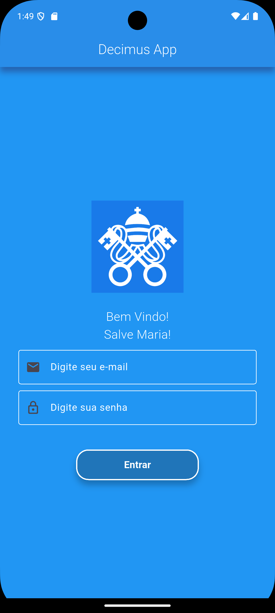
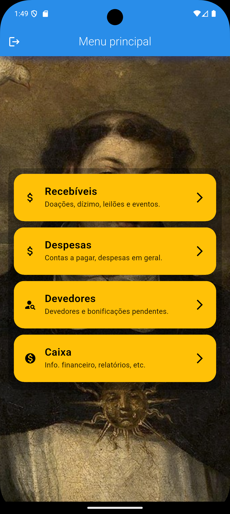
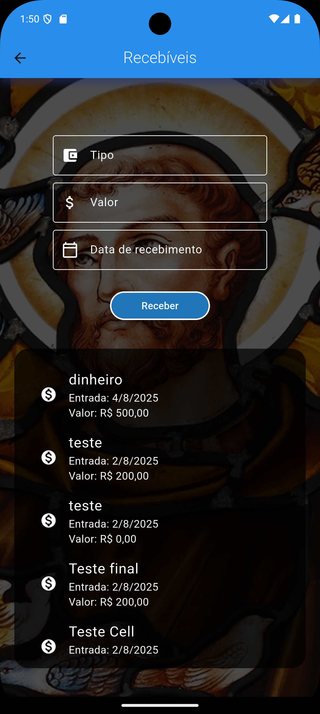
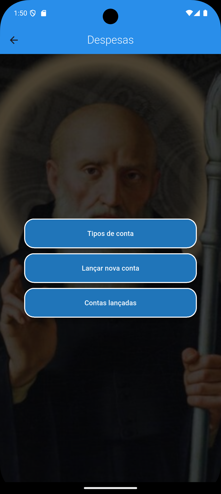
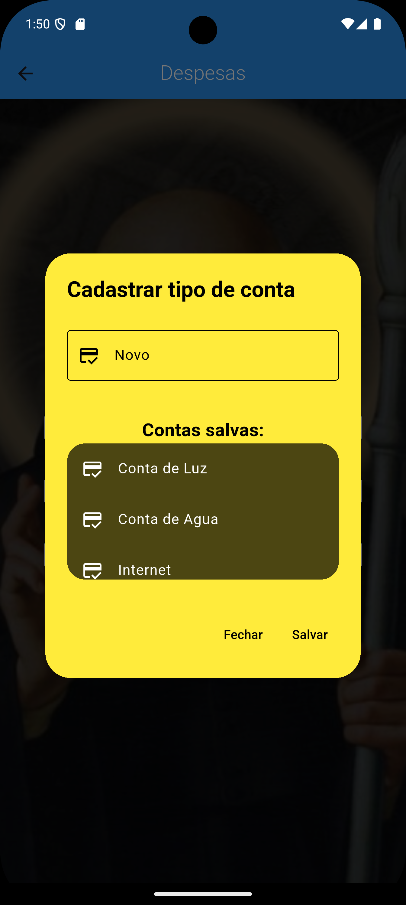
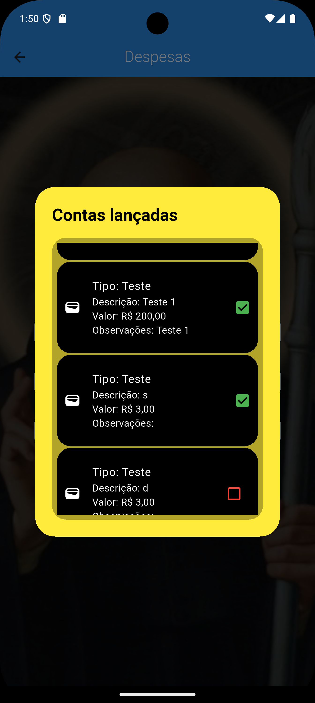

# 📿 Decimus

O **Decimus** é um aplicativo mobile desenvolvido em Flutter, voltado para o **controle de dízimos, despesas e finanças de paróquias católicas**. O projeto surgiu da necessidade de organizar de forma digital os registros financeiros da comunidade, com foco em usabilidade, segurança e acessibilidade.

---

## 📱 Funcionalidades

- ✅ Cadastro de dízimos e devedores  
- ✅ Controle de despesas mensais  
- ✅ Geração de relatórios financeiros  (Futura implementação)
- ✅ Visualização de contas pagas e em aberto  
- ✅ Tela de caixa com extrato de entradas e saídas  
- ✅ Autenticação com Firebase  
- ✅ Integração com Firestore (banco de dados em nuvem)  

---

## 🛠️ Tecnologias Utilizadas

| Tecnologia     | Uso                          |
|----------------|------------------------------|
| Flutter        | Desenvolvimento mobile       |
| Firebase Auth  | Autenticação de usuários     |
| Cloud Firestore| Armazenamento de dados       |
| Dart           | Lógica do app                |
| setState       | Gerenciamento de estado      |
| Flutter PDF    | Geração de relatórios (futuro) |

---

## 🧱 Estrutura de Pastas

```
lib/
├── screens/         # Telas do app
├── services/        # Lógicas e cálculos financeiros
├── models/          # Modelos de dados
├── widgets/         # Componentes reutilizáveis
├── firebase/        # Integrações com Firestore
└── main.dart        # Entrada do aplicativo
```

---

## 🧪 Funcionalidades Futuras

- [ ] Exportar relatórios em PDF  
- [ ] Enviar avisos por WhatsApp  
- [ ] Sistema multi-paróquias  
- [ ] Integração com API de CEP  
- [ ] Tema escuro  

---

## 🚀 Como rodar o projeto

```bash
# Clone o repositório
git clone https://github.com/ryannestacio/decimus.git
cd decimus

# Instale as dependências
flutter pub get

# Execute o app
flutter run
```

---

## 📸 Screenshots

<h3>📱 Tela de Login</h3>

<h3>📱 Tela Princioal</h3>

<h3>📱 Tela de recebíveis</h3>

<h3>📱 Tela de despesas</h3>

<h3>📱 Tela de Despesas - Tipo de conta</h3>

<h3>📱 Tela de Despesas - Cadastrar nova conta</h3>

<h3>📱 Tela de Despesas - Verificar contas</h3>


---

## 🤝 Contribuição

Este projeto é pessoal, mas sugestões de melhorias são bem-vindas. Para contribuir:

1. Faça um fork do projeto.  
2. Crie uma branch: `git checkout -b minha-feature`  
3. Commit suas alterações: `git commit -m 'feat: nova funcionalidade'`  
4. Faça um push: `git push origin minha-feature`  
5. Crie um Pull Request.  

---

## 🧑‍💻 Autor

**Ryan Estácio dos Santos**  
📧 Email: [ryannestacio@icloud.com](mailto:ryannestacio@icloud.com)  
🔗 GitHub: [@ryannestacio](https://github.com/ryannestacio)  
📸 Instagram: [@ryannestacio](https://instagram.com/ryannestacio)  
💼 LinkedIn: [@ryannestacio](https://linkedin.com/in/ryannestacio)  

---

## 📜 Licença

Este projeto está licenciado sob a **MIT License**. Veja o arquivo [LICENSE](LICENSE) para mais detalhes.
